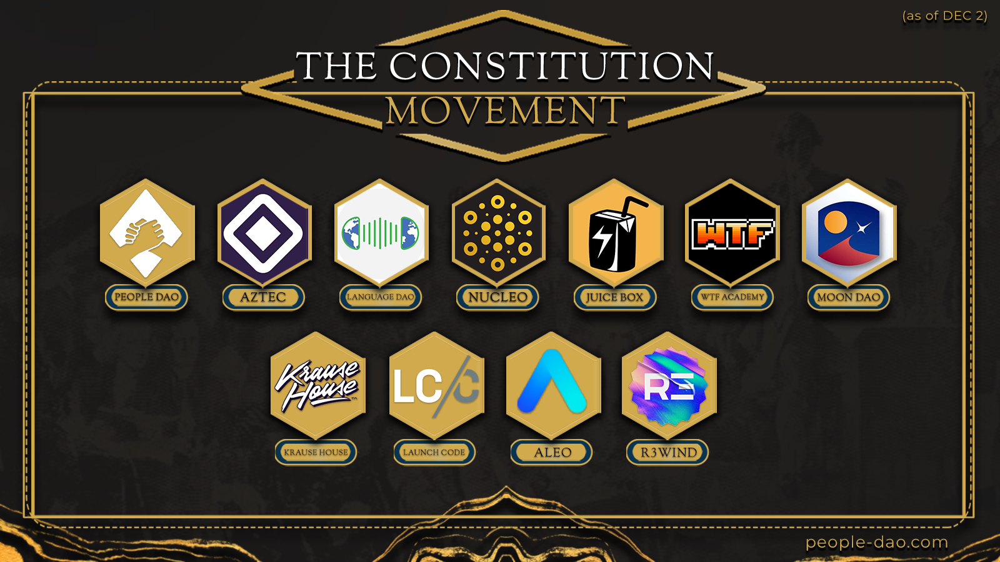

---

slug: CDAO2-proposal

title: JBP-308 - ConstitutionDAO2 Fundraiser

authors: []

tags: [proposals, news]

---

### Synopsis

Almost a dozen web3 groups (and counting) have come together to bid on a private copy of the US Constitution going up for auction at Sotheby’s on December 13. This movement is the spiritual sequel to ConstitutionDAO, with many of the orgs being born from or inspired by the movement last year. We are utilizing the private multisig application Nucleo to obfuscate a portion of the donations to make our bid more competitive, and we plan to raise the remaining funds publicly on Juicebox. We’re prepared to show the world how far crypto has come in one year and to give our community and industry a positive signal. The goal is to start with the Constitution, and then continue acquiring important civic artifacts in order to create a “People’s Museum,” totally controlled by governance NFT holders, rotating to new locations, and educating the public about the history and innovations of democracy.

We are proud to partner with Juicebox given its status as the go-to decentralized platform for projects to raise funds in web3. We are requesting a $150,000 grant from Juicebox at the initiation of the fundraise to seed it. Additionally, we want to use the `holdFees` flag[(1)](#1) to enable us to refund donators in full should we lose the auction.

## Motivation

This proposal will cement our partnership with Juicebox, while simultaneously kickstarting our fundraiser. We recognize that Juicebox plays an essential role in the ecosystem, championing the value of decentralization. Juicebox is an essential tooling in web3 and unlocks the ability for regenerative projects to establish their governance communities. This proposal represents a middle ground between totally shutting off fees and leaving them as is.

## Specification

1. $150K grant sent to the ConstitutionDAO2 fundraiser on Juicebox at the initiation of the fundraiser.
2. Utilization of the `holdFees` flag to enable full refund should we lose the auction
3. Vocal support from Juicebox as a partner in the movement

## Rationale

The expected evaluation of the Constitution is 20 million. If Juicebox fees are 2.5%, and the DAO gives a grant of $150,000 then the fundraiser has to raise at least 6 million for Juicebox to exceed the initial $150,000 put in.

## Risks

If the fundraiser undershoots 6 million but still wins the Constitution in the auction then Juicebox will not receive more fees than the initial amount of the grant.

## Timeline

Within the next couple days the fundraiser will go live and Juicebox should make the 150k donation upon initiation of the fundraiser. Should we lose the auction we expect to do the refund based on the reasonable timeline for such activity. Throughout the auction leading up to Dec 13 the coalition will together advocate for web3 to once again come together to buy a Constitution. Except this time we will win.

***

 Note:

[Hold fees](https://info.juicebox.money/dev/learn/overview/#hold-fees):

By default, JBX membership fees are paid automatically when funds are distributed out of the ecosystem from a project's treasury. During funding cycles configured to hold fees, this fee amount is set aside instead of being immediately processed. Projects can get their held fees returned by adding the same amount of withdrawn funds back to their treasury. Otherwise, JuiceboxDAO or the project can process these held fees at any point to get JBX at the current rate.

This allows a project to withdraw funds and later add them back into their Juicebox treasury without incurring fees.

This applies to both distributions from the distribution limit and from the overflow allowance.

