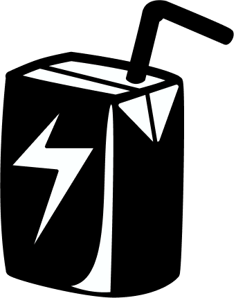
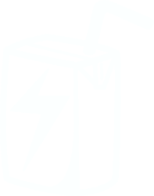

---

title: Brand Kit
---

import './brand-kit.css';

:::tip
Looking for more? Visit the [Wagmi Studios Google Drive](https://drive.google.com/drive/folders/1-06MIi6xI9PjM3ENoUsxe2R-aQe4-uL0).  
Questions/inquiries? Ask in the [Juicebox Discord](https://discord.gg/juicebox).
:::

## Logos
|Type|PNG|SVG|
|-|-|-|
|**Normal**|||
|**Black (Light Mode)**|||
|**White (Dark Mode)**|||

## Style

- Font: [DM Mono](https://fonts.google.com/specimen/DM+Mono)
- Figma: [JBX Component Library](https://www.figma.com/file/HKqBimsKpOxI4oJtqQcv6P/JBX-Component-Library?node-id=1511%3A2594&t=AP5re54kgs93OOkf-1)

### Light Mode Colors

<code>#F5A312</code>

<code>#18B4C7</code>

<code>#FEFDFB</code>

<code>#000000</code>

### Dark Mode Colors

<code>#FFB32C</code>

<code>#32C8DB</code>

<code>#1A181F</code>

<code>#E1E0E8</code>

## Banny

|Type|PNG|SVG|
|-|-|-|
|**Light Mode**|||
|**Dark Mode**|||

## Contact

Questions/inquiries? Visit the [Juicebox Discord](https://discord.gg/juicebox).
